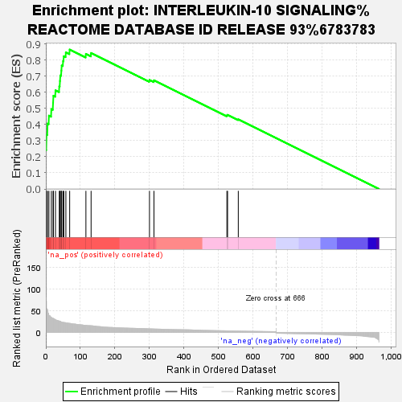
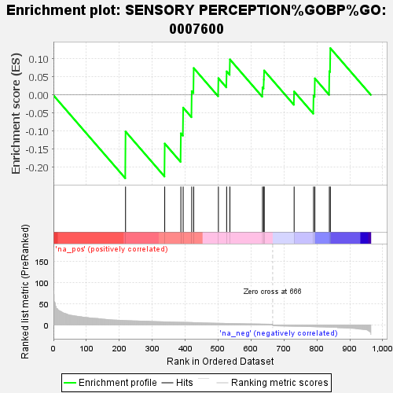
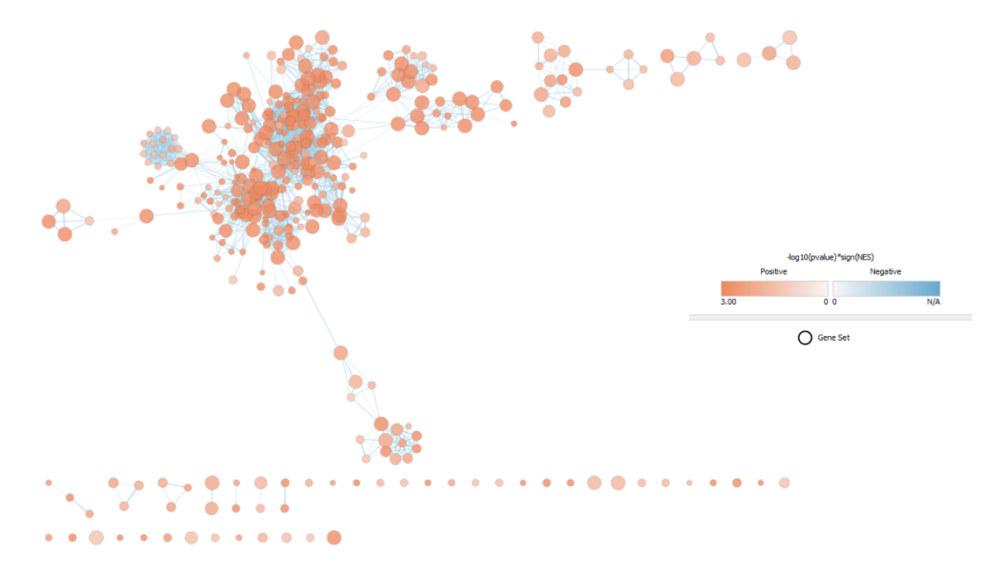
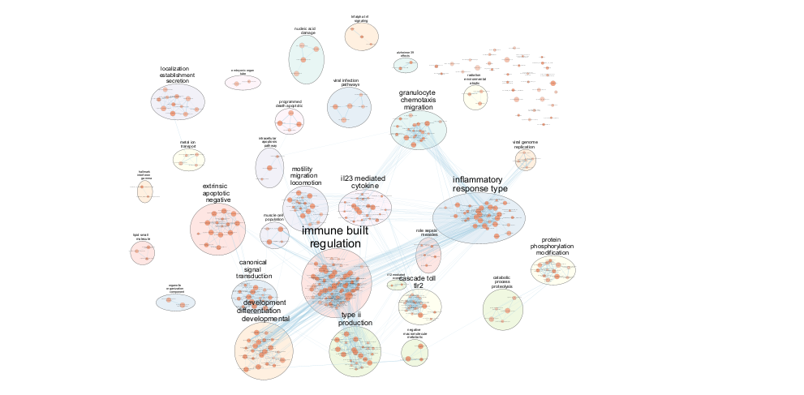
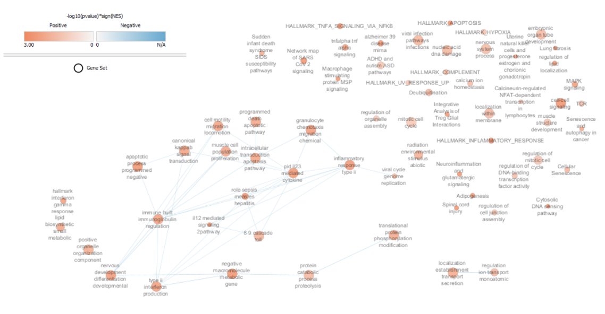

Author: Sabrina Xi

# Assignment 1 Recap

## 1.1 Experimental information

For this assignment, I chose the dataset [GSE236156](https://www.ncbi.nlm.nih.gov/geo/query/acc.cgi?acc=GSE236156). This dataset comes from the study "Epigenetic programming of host lipid metabolism associates with resistance to TST/IGRA conversion after exposure to Mycobacterium tuberculosis" which examines the possible mechanisms of TB resistance after prolonged exposure. It also examines the effect of exposure to Mycobacterium tuberculosis (Mtb), the pathogen responsible for tuberculosis (TB), on alveolar macrophages (AMs) and recruited monocyte-derived macrophages (MDMs) which mediate the early lung immune response to Mtb. The resulting RNA-seq gene expression data of both AMs and MDMs upon treatment with and without Mtb composes this dataset, which is the particular experimental treatment condition we are analyzing here. 


## 1.2 Load in Normalized and Scored Differentially Expressed Dataset

In assignment 1, I downloaded the raw counts and assessed the data quality through library size comparison and MDS clustering to confirm treatment separation and coverage. I cleaned and scored my dataset, resulting in a selection of 965 normalized differentially highly/lowly expressed genes. We observed a good coverage from this dataset for expression analysis and some association between our treatment and expression. The normalized and scored dataset was saved to this the ```data``` folder in this assignment, and we load it in. 
```{r}
sigde <- readRDS("data/sigde_stats.rds")
```


# Thresholded Over-Represented Analysis (ORA)

## 2.1 Complete ORA Analysis

For my enrichment analysis, I used g:Profiler (Kolberg et al. 2020), which is a tool for characterizing gene lists and performs enrichement analysis through g:GOSt. I chose this tool as it funnels annotation information from an extensive array of databases including GO, Reactome, WikiPathways, and KEGG. All databases available through g:Profiler were selected to ensure as wide a coverage of annotation sources as possible. The gene build used was "GRCh38.p14" pulled from Ensembl 113. These databases include:
1. Gene Ontology: Biological Processes (GO:BP), 2025-03-16 release
2. Gene Ontology: Cellular Component (GO:CC), 2025-03-16 release
3. Gene Ontology: Molecular Function (GO:MF), 2025-03-16 release
2. Keyoto Encyclopedia of Genes and Genoems (KEGG), 2024-01-22 release
3. Reactome, 2025-05-23 release
4. WikiPathways, 2025-05-10 release
5. TRANSFAC, 2024-02 release
6. miRTarBase, version 10.0
7. Human Protein Atlas (HPA), 20214-10-19 release
8. CORUM, version 4.1 (2022-11-28 release)
9. Human Phenotype Ontology (HP), 2025-05 release
The results can be visualized through a plot of significant enriched terms using the ```gostplot``` function: 
```{r}
library(gprofiler2)
library(ggplot2)

sigde_vector <- as.vector(rownames(sigde))
gostres <- gost(query = sigde_vector, organism = "hsapiens", exclude_iea = TRUE, highlight = TRUE, domain_scope = "annotated", numeric_ns = "ENTREZGENE_ACC", correction_method = "fdr")

gostplot(gostres, capped = TRUE, interactive = FALSE) + ggtitle("Functional Enrichment Analysis of All Differentially Expressed Genes")
```

**Figure 1.1.** Plot of functional enrichment analysis of all differentially expressed genes. Each circle represents a term. Circle size corresponds to term size. The x-axis corresponds to functional terms grouped and color-coded by data source (corresponding to one of the databases listed above). The y-axis corresponds to the negative log of the adjusted enrichment p-value. The dashed line corresponds to a threshold indicating values with adjusted p-values less than 10^-16. Values above that line are highly significant. 

```{r}
ordered_gostres <- gostres$result[order(gostres$result$p_value, decreasing = FALSE), ]
rmarkdown::paged_table(ordered_gostres[1:10, c("source", "term_name", "p_value", "highlighted")])
```
**Table 1.1.** Top ten most significant terms from ORA for all differentially expressed genes. Significance is assessed using the outputted adjusted p-value from g:Profiler. 

1735 terms were returned as being significantly enriched. The strongest significantly enriched terms were found in GO:BP, the top being "response to peptide" (p_adj = 4.242024e-42, id = GO:1901652). The second most significant and top driver term is "defense response" (p_adj = 4.242024e-42, id = GO:0006952). In general, the top 20 most significantly enriched terms belonged to GO:BP. Though these terms broadly align with the knowledge that Mtb describes a pathogenic infection, they are very general terms that make it difficult to draw more specific conclusions. 

General terms can corresponds to larger term size, so it is possible to try and narrow our terms by only keeping sets between 5-200:
```{r}
gostres_filtered <- gostres
gostres_filtered$result <- gostres_filtered$result[gostres_filtered$result$term_size <= 200 & gostres_filtered$result$term_size >= 5, ]

gostplot(gostres_filtered, capped = TRUE, interactive = FALSE) + ggtitle("Functional Enrichment Analysis of All Differentially Expressed Genes")
```

**Figure 1.2.** Plot of functional enrichment analysis of all differentially expressed genes with term sizes between 5 and 200. Each circle represents a term. Circle size corresponds to term size. The x-axis corresponds to functional terms grouped and color-coded by data source (corresponding to one of the databases listed above). The y-axis corresponds to the negative log of the adjusted enrichment p-value. The dashed line corresponds to a threshold indicating values with adjusted p-values less than 10^-16. Values above that line are highly significant. 

```{r}
ordered_filteredgostres <- gostres_filtered$result[order(gostres_filtered$result$p_value, decreasing = FALSE), ]
rmarkdown::paged_table(ordered_filteredgostres[1:10, c("source", "term_name", "p_value", "highlighted")], options = list(rownames.print = FALSE))
```
**Table 1.2.** Top ten most significant terms from ORA for all differentially expressed genes with term sizes between 5 and 200. Significance is assessed using the outputted adjusted p-value from g:Profiler. 

The resulting terms are much more specific. The top term "cellular response to molecule of bacterial origin" (p_adj = 8.762675e-21, id = GO:0071219) from GO:BP accurately identifies Mtb as a pathogenic bacteria (Dill-McFarland 2024). While this term is still rather broad, the top driver term "cytokine activity" (p_adj = 7.199692e-17, id = GO:0005125) from GO:MF is a little more specific. Interestingly, we see many terms related to inflammation, which in the context of tuberculosis, is mediated by cytokines (Domingo-Gonzalez 2017). 

This gene list was also submitted to g:Profiler through its online web server. Findings are discussed further in my wiki journal. 


## 2.2 ORA of Upregulated Genes

ORA of the complete set allows us to glean valuable information regarding gene expression, but the direction of expression is also important. A gene showing enriched expression that is upregulated has a different significance than if it is downregulated, so we also conduct ORA of the genes that are upregulated separately. Of the 965 total genes, 666 were upregulated. We can directly threshold the results. Conducting analysis using g:GOST on these genes returned:
```{r}
upsig_genes <- sigde[sigde$log2FoldChange > 0, ]

upsig_vector <- as.vector(rownames(upsig_genes))
up_gostres <- gost(query = upsig_vector, organism = "hsapiens", exclude_iea = TRUE, highlight = TRUE, domain_scope = "annotated", numeric_ns = "ENTREZGENE_ACC", correction_method = "fdr")

up_gostres$result <- up_gostres$result[up_gostres$result$term_size <= 200 & up_gostres$result$term_size >= 5, ]

gostplot(up_gostres, capped = TRUE, interactive = FALSE) + ggtitle("Functional Enrichment Analysis of Upregulated Differentially Expressed Genes")
```

**Figure 2.1.** Plot of functional enrichment analysis of upregulated differentially expressed genes with term sizes between 5 and 200. Each circle represents a term. Circle size corresponds to term size. The x-axis corresponds to functional terms grouped and color-coded by data source (corresponding to one of the databases listed above). The y-axis corresponds to the negative log of the adjusted enrichment p-value. The dashed line corresponds to a threshold indicating values with adjusted p-values less than 10^-16. Values above that line are highly significant.

```{r}
ordered_upgostres <- up_gostres$result[order(up_gostres$result$p_value, decreasing = FALSE), ]
rmarkdown::paged_table(ordered_upgostres[1:10, c("source", "term_name", "p_value", "highlighted")], options = list(rownames.print = FALSE))
```
**Table 2.1.** Top ten most significant terms from ORA for upregulated differentially expressed genes with term size between 5 and 200. Significance is assessed using the outputted adjusted p-value from g:Profiler. 

The top results are very similar to the analysis for the overall dataset with the top nine terms being shared, indicating that the downregulated terms accounted for many of the most significant results. The top term ("cellular response to molecule of bacterial origin") and the top driver term ("cytokine activity") were the same as well.

Interleukin-10 and TNF are cytokines, which play a role in mediating inflammation. Therefore, six of these terms relate to inflammation regulation, indicating that this is a broad biological theme from this analysis. We also see many terms relating to the nature of Mtb as a bacteria, though these are more general, which is likely why they are not driver terms.  


## 2.3  ORA of Downregulated Genes

```{r}
downsig_genes <- sigde[sigde$log2FoldChange < 0, ]

downsig_vector <- as.vector(rownames(downsig_genes))
down_gostres <- gost(query = downsig_vector, organism = "hsapiens", exclude_iea = TRUE, highlight = TRUE, domain_scope = "annotated", numeric_ns = "ENTREZGENE_ACC", correction_method = "fdr")

down_gostres$result <- down_gostres$result[down_gostres$result$term_size <= 200, ]

gostplot(down_gostres, capped = TRUE, interactive = FALSE) + ggtitle("Functional Enrichment Analysis of Downregulated Genes")
```

**Figure 3.1.** Plot of functional enrichment analysis of downregulated differentially expressed genes with term sizes between 5 and 200. Each circle represents a term. Circle size corresponds to term size. The x-axis corresponds to functional terms grouped and color-coded by data source (corresponding to one of the databases listed above). The y-axis corresponds to the negative log of the adjusted enrichment p-value. The dashed line corresponds to a threshold indicating values with adjusted p-values less than 10^-16. Values above that line are highly significant.

```{r}
ordered_downgostres <- down_gostres$result[order(down_gostres$result$p_value, decreasing = FALSE), ]
rmarkdown::paged_table(ordered_downgostres[1:10, c("source", "term_name", "p_value", "highlighted")], options = list(rownames.print = FALSE))
```
**Table 3.1.** Top ten most significant terms from ORA for downregulated differentially expressed genes with term size between 5 and 200. Significance is assessed using the outputted adjusted p-value from g:Profiler. 

There were 33 terms. Only genesets with large term sets were removed for being above the treshold of 200. We did not set lower treshold to keep a more comprehensive selection of the sets as the majority save for two were below 5.

The top term was "NIAP homotetramer complex" (p_adj = 0.03095275, id = CORUM:3335) from CORUM. The remaining terms were also from CORUM. 


## Interpretations of Results

The paper this dataset was extracted from primarily analyzed the epigenetic composition of heavily exposed patients exhibiting resistance to testing (RSTR) in support of finding a IFNγ-independent mechanisms of Mtb control, so it only lightly touched on the healthy donor set this dataset was extracted from.

This study did identify IFNγ and IFNα as being highly induced genesets, which we did not find here (Dill-McFarland 2024). This may be due to the highly general character of the genesets we identified in our ORA. IFNs are broadly classified as cytokines, so it is possible that if we had narrowed the range of terms to be more specific, we would have encountered similar results.  

However, there is a wealth of literature focusing on the mechanisms and effects of Mtb infection on healthy cells. Broadly, our conclusions are supported by other papers and studies. 

The top two terms in our downregulated set were associated with apoptosis regulation. This is aligned with other findings, as macrophage apoptosis is known to be associated with diminished pathogen viability (Lee et al. 2009). Virulent Mtb is thought to inhibit the the regulation of cell death to induce necrosis, which allows the bacteria to evade host defenses and spread more easily when exiting the macrophage (Behar et al. 2011). The cells in this study were macrophages.

The upregulation of genesets involved in inflammation is supported by the literature, and cytokines are known to play a significant role in addressing Mtb infection. As a primary mechanism, the Mtb pathogen induces inflammation which the immune system then needs to regulate. In many successful cases, Mtb causes no symptoms other than an inflammatory response to the antigen, which is a method of testing for TB contact (Domingo-Gonzalez 2016). As the mechanism of infection is so deeply related to the inflammatory response, it stands to reason that this geneset would be one of the top outputs.

Broadly, we see that the downregulated and upregulated genesets are clearly divided. The upregulated set clearly dominates the downregulated set, with the general analysis reflecting only upregulated terms. 


# Non-Thresholded Gene Set Enrichment Analysis (GSEA)

## 3.1 GSEA PreRanked

We can compare our tresholded results to a non-thresholded analysis. To do so, we will use GSEA Preranked (Subramanian et al. 2005). 

We rank the genes based on a combination of log fold-change and log of the p-value. While log-fold does showcase the change, it can be inflated for smaller gene counts. We can combine that with p-value and keep the signed direction, then sort the dataframe in descending order. 
```{r}
# add new column with combined fold-change and p-value
gseaset <- sigde
gseaset$fcp <- sign(gseaset$log2FoldChange)*(-log10(gseaset$pvalue))

# order in decreading value
gseaset <- gseaset[order(gseaset$fcp, decreasing = TRUE), ]

gsea_ranked <- gseaset["fcp"]

# write to a file to be input in GSEA
write.table(gsea_ranked, file = "ranked_genes_decreasing.rnk", sep="\t", quote = FALSE)
```

We run GSEA Preranked using the ranked gene list created here and the September 1rst, 2025 version of the annotated dataset from the Bader Lab with no PFOCR and electronic GO annotations. We will only keep genesets between 15 and 200 in size, which is the default for GSEA. 


### 3.1.1 Results

The output of GSEA showed some differences with our ORA. Out of 774 enriched genesets, 771 were upregulated with 562 significant at FDR < 25% and 448 with nominal p-value < 5%. 3 were downregulated with 0 significant at FDR < 25% and 0 with p-value < 5%. 


## 3.2 Upregulated Enrichment in "Interleukin-10 Signaling"

The highest enriched geneset in the upregulated set was "Interleukin-10 signaling" with NES = 2.38, size = 24, nominal p-value = 0, FDR q-value = 0, and rank at max = 69. TNF is the top associated gene. 
```{r}
library("knitr")


```

**Figure 4.1.** GSEA enrichment plot for "Interleukin-10 Signaling" gene set. The y-axis represents the enrichment score (ES) and the x-axis represents progression along the ranked list. The ES curve peaks around 0.85 early in the graph, indicating significant enrichment among the top ranked upregulated genes. Black lines represent genes in the gene set. Black lines before the peak score (leading edge subset) contribute the most to ES. The ranked list metric represents the correlation between a gene and the phenotype. 

The early rise and peak of the curve showcases that the henes in "Interleukin-10 signalling" were not randomly distributed in the list but rather clustered among the top-ranked upregulated genes. This indicates that the corresponding geneset is significant. 

This aligns strongly with the results from our thresholded ORA, which also contained "Interleukin-10 pathway" among its top terms. Among the other top hits, we see again that there is a focus on cytokine presence and inflammation immune response. 


## 3.2 Downregulated Enrichment in "Sensory Perception"

The highest enriched geneset in the downregulated set was "Sensory Perception" with NES = -0.92, size = 17, nominal p-value = 1, FDR q-value = 1, and rank at max = 747. OR2B11 is the top associated core gene.  

```{r}

```

**Figure 4.2.** GSEA enrichment plot for "Sensory Perception" gene set. The y-axis represents the enrichment score (ES) and the x-axis represents progression along the ranked list. The ES curve is furthest from 0 at -0.23. Black lines represent genes in the gene set. Black lines after the peak score (leading edge subset) contribute the most to ES. The ranked list metric represents the correlation between a gene and the phenotype. 

The enrichment plot for this gene set is  less significant that that of the upregulated set. Without a clear peak and with genes distributed across the whole ranked list, this aligns with the output p-value and FDR as not significant. Unfortunately, there are no other significant downregulated gene sets, so it is difficult to draw conclusions regarding our downregulated set. 

While this makes it difficult to compare to our ORA results, it is interesting to note that one downregulated term "MYO7A-PDZD7 complex" is also known to be involved in sensory and audio perception. 

It is also interesting to note that the second highest gene set found here is "Lipid Catabolic Process", the regulation of which the paper this dataset was extracted from found to play a possible role in RSTR emergence (Dill-McFarland 2024). However, due to the low significance of this gene set, it is difficult to otherwise draw conclusions in this regard. 


# Cytoscape Visualization

## 4.1 EnrichmentMap Visualization

Using the ```EnrichmentMap``` app (Reimand et al. 2019) in Cytoscape (Shannon et al. 2003), we produced a graph visualization of our GSEA output: 
```{r}

```

**Figure 5.1.** EnrichmentMap visualization of GSEA dataset using Cytoscape with an edge cutoff of 0.375 and Q-value node cutoff of 0.05. Each node represents a geneset and each line represents common genes between sets (thickness indicating the number of common genes). Red nodes represent upregulated genes, which comprise this map as the nominal number of downregulated genes are not significant. The shade is scaled by ```-log10(p-value)*sign(NES)```. There are 366 nodes and 2277 edges.

From this mapping, we note a big cluster, a few smaller clusters, and several smaller gene sets with either no connections or very few. We can further explore the clusters by annotating the EnrichmentMap.


## 4.2 Annotated EnrichmentMap

We used AutoAnnotate (Kucera et al. 2013) to annotate our visualization. Default parameters were used, with the label corresponding to the most frequent words in the cluster and adjacent words annotated using WordCloud (Oesper et al. 2011). The default parameters of 1 minimum word occurrence and 8 adjacent word bonus were used, with a maximum label length of 3.
```{r}

```

**Figure 5.2.** Annotated clustering of Figure 5.1. Each coloured circle represents a cluster of genesets as determined by AutoAnnotate. The colors do not represent anything. Each label corresponds to the most significant node in the cluster, as identified using the lowest p-value.

Due to the low significance of our downregulated genesets, all the clusters here represent upregulated themes. We see upregulation in clusters relating to inflammation and immunity, similar to both our GSEA and ORA results. 


## 4.3 Summary Network


```{r}

```

**Figure 5.3.** Summary network of Figure 5.1. Each node represents an overarching biological theme identified by AutoAnnotate through collapsing the clusters in Figure 5.2 and each edge represents common genes. Red nodes identify positive enrichment direction scaled by ```-log10(p-value)*sign(NES)```. Node size represents the number of genesets within each cluster. 

We see inflammation among the top themes again, including themes of cytokines, interleukin, MAPK, TNF, and interferon upregulation. We also see some upregulated themes revolving other diseases, including Sars-Cov2 signaling, which implies that there may be some overlap in the mechanisms or targets of these diseases. Interestingly, we also see a theme regarding negative regulation of apoptosis, which concords with our findings in the ORA. 

However, by and large, we see many individual themes that do not concord with the themes we saw in ORA or with each other. This may imply that Mtb causes a large span of unrelated conditions, or that further refinement of results is necessary. 

## 4.4 Interpretation of Results

From our results, we see similar themes that we saw in our ORA. In comparison with our ORA, we do see a higher presence of interferon pathway upregulation which aligns with the results in our original paper. This can be seen in our summary network and original EnrichmentMap network. 

We also see a repeat of the inflammation motif, as we did in our ORA. This once again aligns with the existing literature regarding the suspected mechanism of the manipulation of the inflammation response by Mtb infection (Domingo-Gonzalez 2016). 

Similarly to the ORA results, we also see the domination of upregulated genesets compared to downregulated genesets, implying that the downregulation mechanisms of Mtb may not belong to a well-studied area or has a smaller effect. 

However, we also see a large disparity in themes from our analysis, with many genesets unclustered. This implies that Mtb affects many different pathways and functions within the body, which may not be as well studied. 


# Conclusion 

We conducted thresholded ORA and non-thresholded GSEA of our differentially expressed gene dataset to identify enriched upregulated and downregulated gene expression. While many of our results were general, we identified a clear theme of immune response and inflammation response through cytokines as a result of Mtb exposure to healthy macrophage cells, which concords with the paper this dataset was extracted from and the established body of literature. However, we did not find overwhelming upregulation of any IFN pathways compared to other themes, which may be due to the general nature of our study. Further analysis with more specific databases and tresholds might be useful. 


# References

Abdalla A. E., Lambert N., Duan X., & Xie J. (2016). Interleukin-10 Family and Tuberculosis: An Old Story Renewed. International journal of biological sciences, 12(6), 710–717. https://doi.org/10.7150/ijbs.13881

Agrawal A., et al. (2024) WikiPathways 2024: next generation pathway database. NAR.

Allaire J., et al. (2025). _rmarkdown: Dynamic Documents for R_. R package version 2.30,   
  <https://github.com/rstudio/rmarkdown>.
  
Behar, S. M., et al. (2011). Apoptosis is an innate defense function of macrophages against Mycobacterium tuberculosis. Mucosal immunology, 4(3), 279–287. https://doi.org/10.1038/mi.2011.3

Benjamini, Y., and Hochberg, Y. (1995). Controlling the false discovery rate: a practical and powerful 
  approach to multiple testing. Journal of the Royal Statistical Society Series B, 57, 289–300. 
  doi:10.1111/j.2517-6161.1995.tb02031.x.

Dill-McFarland K. A., et al. (2024). Epigenetic programming of   host lipid metabolism associated with resistance to TST/IGRA conversion after exposure to Mycobacterium tuberculosis. mSystems, 9(9), e0062824. https://doi.org/10.1128/msystems.00628-24

Domingo-Gonzalez, R., Prince, O., Cooper, A., & Khader, S. A. (2016). Cytokines and Chemokines in Mycobacterium tuberculosis Infection. Microbiology spectrum, 4(5), 10.1128/microbiolspec.TBTB2-0018-2016. https://doi.org/10.1128/microbiolspec.TBTB2-0018-2016

Gargano MA, et al. The Human Phenotype Ontology in 2024: phenotypes around the world. Nucleic Acids Res. 2024 Jan 5;52(D1):D1333-D1346. doi: 10.1093/nar/gkad1005. PMID: 37953324; PMCID: PMC10767975., https://doi.org/10.1093/nar/gkad1005

Hsu S., et al. (2011). miRTarBase: a database curates experimentally validated microRNA-target interactions. Nucleic acids research, 39(Database issue), D163–D169. https://doi.org/10.1093/nar/gkq1107

Kanehisa, M., Furumichi, M., Sato, Y., Matsuura, Y. and Ishiguro-Watanabe, M.; KEGG: biological systems database as a model of the real world. Nucleic Acids Res. 53, D672-D677 (2025). 

Kolberg L., et al. (2020). “gprofiler2- an R package for
  gene list functional enrichment analysis and namespace conversion toolset g:Profiler.”
  _F1000Research_, *9 (ELIXIR)*(709). R package version 0.2.4.

Kolberg L., et al. g:Profiler—interoperable web service for functional enrichment analysis and gene identifier mapping (2023 update) Nucleic Acids Research, May 2023; doi:10.1093/nar/gkad347.
  
Kucera, M., Isserlin, R., Arkhangorodsky, A., & Bader, G. D. (2016). AutoAnnotate: A Cytoscape app for summarizing networks with semantic annotations. F1000Research, 5, 1717. https://doi.org/10.12688/f1000research.9090.1

Lee, J., Hartman, M., & Kornfeld, H. (2009). Macrophage apoptosis in tuberculosis. Yonsei medical journal, 50(1), 1–11. https://doi.org/10.3349/ymj.2009.50.1.1

Milacic M., et al. The Reactome Pathway Knowledgebase 2024. Nucleic Acids Research. 2024. doi: 10.1093/nar/gkad1025.

Oesper, L., Merico, D., Isserlin, R., & Bader, G. D. (2011). WordCloud: a Cytoscape plugin to create a visual semantic summary of networks. Source code for biology and medicine, 6, 7. https://doi.org/10.1186/1751-0473-6-7

R Core Team (2025). _R: A Language and Environment for Statistical Computing_. R Foundation for   
  Statistical Computing, Vienna, Austria. <https://www.R-project.org/>.

Reimand, J., Isserlin, R., Voisin, V. et al. Pathway enrichment analysis and visualization of omics data using g:Profiler, GSEA, Cytoscape and EnrichmentMap. Nat Protoc 14, 482–517 (2019). https://doi.org/10.1038/s41596-018-0103-9

Shannon, P.,  et al. (2003). Cytoscape: a software environment for integrated models of biomolecular interaction networks. Genome research, 13(11), 2498–2504. https://doi.org/10.1101/gr.1239303

Subramanian A., et al. Gene set enrichment analysis: A knowledge-based approach for interpreting genome-wide expression profiles, Proc. Natl. Acad. Sci. U.S.A. 102 (43) 15545-15550, https://doi.org/10.1073/pnas.0506580102 (2005).

The Gene Ontology Consortium. The Gene Ontology knowledgebase in 2026. Nucleic Acids Res. 2025 Dec 18;gkaf1292. DOI: 10.1093/nar/gkaf1292

Tsitsiridis G., et al. CORUM: the comprehensive resource of mammalian protein complexes–2022, Nucleic Acids Research, Volume 51, Issue D1, 6 January 2023, Pages D539–D545, https://doi.org/10.1093/nar/gkac1015

Wickham H. ggplot2: Elegant Graphics for Data Analysis. Springer-Verlag New York, 2016.

Wingender E., et al. TRANSFAC: an integrated system for gene expression regulation, Nucleic Acids Research, Volume 28, Issue 1, 1 January 2000, Pages 316–319, https://doi.org/10.1093/nar/28.1.316
